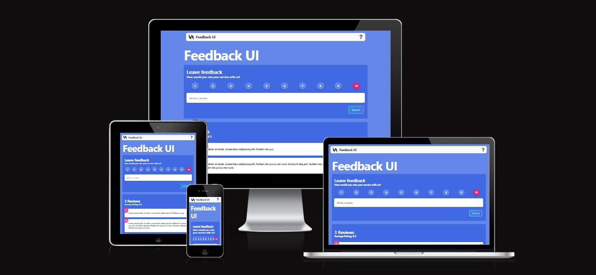

# React Feedback App



## Overview

This is a React-based feedback application built to practice React, TypeScript, Tailwind CSS, and Framer Motion skills. The app allows users to view, add, and delete ratings, providing a simple yet interactive user experience.

## Technologies Used

- **React** (with Vite)
- **TypeScript**
- **Tailwind CSS**
- **Framer Motion**

## Features

- View predefined ratings
- Add new ratings
- Delete existing ratings
- Smooth animations with Framer Motion
- Responsive design with Tailwind CSS

## Prerequisites

Before you begin, ensure you have the following installed:
- Node.js (v14.0.0 or later)
- npm (v6.0.0 or later)

## Installation

1. Clone the repository
   ```bash
   git clone <Repo URL>
   ```

2. Navigate to the project directory
   ```bash
   cd review-demo
   ```

3. Install dependencies
   ```bash
   npm install
   ```

## Running the Application

To run the application in development mode:
```bash
npm run conc
```

Open [http://localhost:5173](http://localhost:5173) to view it in the browser.

## Building for Production

To create a production build:
```bash
npm run build
```

## Project Structure

```
feedback-app/
│
├── src/
│   ├── assets/
│   ├── components/
│   ├── data/
│   ├── types/
│   ├── globals.css
|   └── App.tsx
│
├── public/
├── index.html
├── tailwind.config.js
├── vite.config.ts
└── tsconfig.json
```

## State Management

The app uses React's `useState`, `useEffect` and `useContext` hook for managing the ratings state, demonstrating basic state management in React with TypeScript.

## Styling

Tailwind CSS is used for rapid, utility-first styling, ensuring a responsive and clean design across different device sizes.

## Animations

Framer Motion provides smooth enter/exit animations for ratings, enhancing the user interface.

## Learning Objectives

This project was created to practice:
- React fundamentals
- TypeScript type safety
- Component composition
- State management
- Styling with Tailwind CSS
- Adding animations with Framer Motion

## Future Improvements

- Add persistent storage (localStorage/backend)
- Add more robust form validation
- Create unit and integration tests